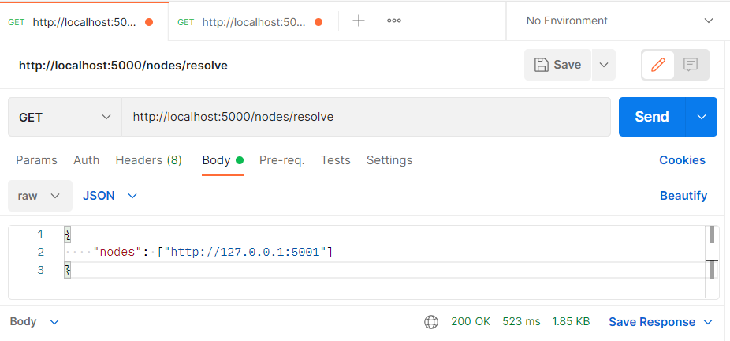

Blockchain

A basic Blockchain Implementation

## Running a Blockchain Node
Python application built with Flask. Run the server with:
`flask run --port 500x`

## View the Chain
To view the current chain from a Node
`GET /chain`

## Mine a Block
`GET /mine`

## Create a new Transaction
`POST /transactions/new
{
 "sender": "d4ee26eee15148ee92c6cd394edd974e",
 "recipient": "someone-other-address",
 "amount": 5
}
`

## Register a 
`(GET) /nodes/register`

## Resolve a Node (Consensus)
`POST /nodes/resolve
{
    "nodes": ["http://127.0.0.1:5001", ...]
}
`
